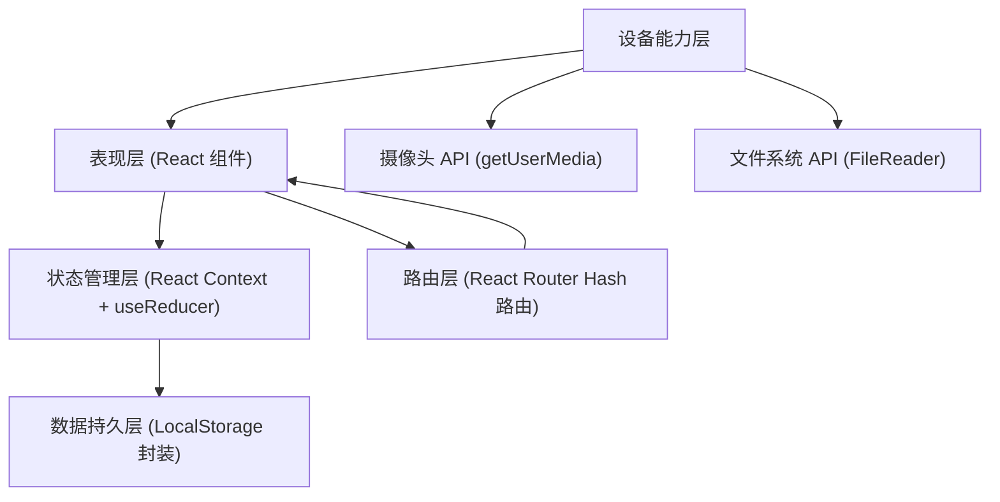
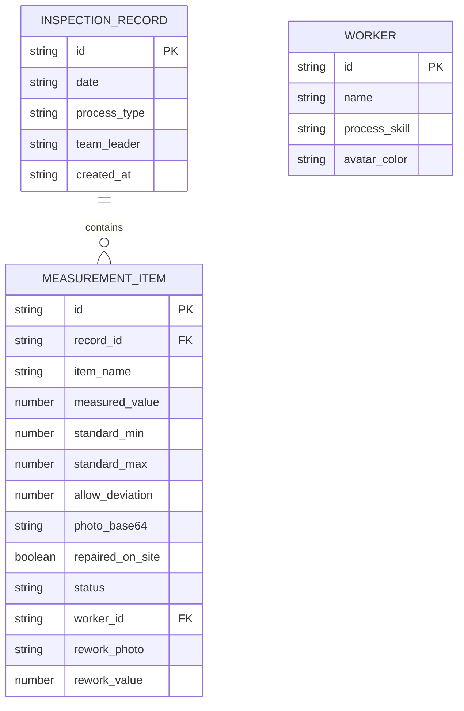

## 1. 架构设计

纯前端单页应用（SPA），无后端依赖，数据通过浏览器 LocalStorage 本地持久化。架构分层清晰，专注移动端操作体验。



## 2. 技术选型说明

- **前端框架**：React@18 + TypeScript，使用函数组件 + Hooks，类型安全减少数据录入错误
- **构建工具**：Vite@5，启动快、热更新快，适合开发调试
- **样式方案**：TailwindCSS@3，原子化 CSS 快速构建大按钮、大间距的工地风格界面
- **图标方案**：Lucide React + 自定义 SVG 施工工具图示（靠尺、塞尺、水平仪等写实示意图）
- **路由方案**：React Router v6 Hash 模式，无需服务器配置，静态文件直接部署
- **状态管理**：React Context + useReducer，集中管理自检记录、返工清单、合格记录
- **数据存储**：LocalStorage 封装层，JSON 序列化，照片以 base64 字符串存储
- **摄像头**：HTML5 `<input type="file" accept="image/*" capture="environment">` 调用系统相机

## 3. 路由定义
| 路由路径 | 页面名称 | 说明 |
|----------|----------|------|
| `#/` / `#/checklist` | 今日自检 | 默认首页，工序选择 + 实测项录入 |
| `#/rework` | 返工清单 | 超差点列表 + 复测操作 |
| `#/records` | 合格记录 | 历史合格数据追溯 |

## 4. 数据模型

### 4.1 数据模型 ER 图



### 4.2 核心类型定义（TypeScript）

```typescript
// 工序类型
type ProcessType = 'plastering' | 'tiling' | 'flooring' | 'masonry';

// 实测项定义
interface MeasurementItemDef {
  id: string;
  name: string;
  unit: string;
  standardValue: number;
  allowDeviation: number;  // ± 允许偏差
  description: string;     // 工具放置说明
  diagramSvg: string;      // 内置 SVG 图示标识
}

// 录入的实测记录
interface MeasurementRecord {
  id: string;
  itemDefId: string;
  itemName: string;
  measuredValue: number | null;
  standardValue: number;
  allowDeviation: number;
  photo: string | null;    // base64
  repairedOnSite: boolean;
  isPass: boolean | null;  // 计算属性
}

// 每日自检记录
interface DailyInspection {
  id: string;
  date: string;            // YYYY-MM-DD
  processType: ProcessType;
  teamLeader: string;
  measurements: MeasurementRecord[];
  createdAt: number;
}

// 返工项（从超差的 MeasurementRecord 生成）
interface ReworkItem {
  id: string;
  sourceRecordId: string;
  date: string;
  processType: ProcessType;
  itemName: string;
  originalValue: number;
  standardValue: number;
  allowDeviation: number;
  deviationAmount: number;
  photo: string | null;
  assignedWorkerId: string | null;
  status: 'pending' | 'rechecking' | 'passed' | 'failed_again';
  recheckValue: number | null;
  recheckPhoto: string | null;
  recheckDate: string | null;
}

// 工人
interface Worker {
  id: string;
  name: string;
  skill: ProcessType[];
  color: string;
}

// 全局状态
interface AppState {
  workers: Worker[];
  inspections: DailyInspection[];
  reworks: ReworkItem[];
}
```

### 4.3 各工序实测项标准（内置数据）

**抹灰（plastering）** - 4 项：
| 测项 | 标准值 | 允许偏差 | 工具 |
|------|--------|----------|------|
| 立面垂直度 | 0mm | ±4mm | 2m 靠尺 + 塞尺 |
| 表面平整度 | 0mm | ±4mm | 2m 靠尺 + 塞尺 |
| 阴阳角方正 | 90° | ±4mm | 直角检测尺 |
| 墙裙上口平直 | 0mm | ±4mm | 5m 拉线 + 钢直尺 |

**贴砖（tiling）** - 4 项：
| 测项 | 标准值 | 允许偏差 | 工具 |
|------|--------|----------|------|
| 表面平整度 | 0mm | ±2mm | 2m 靠尺 + 塞尺 |
| 立面垂直度 | 0mm | ±2mm | 2m 靠尺 |
| 接缝高低差 | 0mm | ±0.5mm | 钢直尺 + 塞尺 |
| 空鼓率 | 0% | ≤5% | 小锤敲击 |

**地坪（flooring）** - 3 项：
| 测项 | 标准值 | 允许偏差 | 工具 |
|------|--------|----------|------|
| 表面平整度 | 0mm | ±4mm | 2m 靠尺 + 塞尺 |
| 标高偏差 | 设计标高 | ±10mm | 水平仪 + 标尺 |
| 坡度 | 设计坡度 | ±0.2% | 坡度尺 |

**砌筑（masonry）** - 5 项：
| 测项 | 标准值 | 允许偏差 | 工具 |
|------|--------|----------|------|
| 轴线位移 | 0mm | ±10mm | 经纬仪 + 钢直尺 |
| 垂直度（每层） | 0mm | ±5mm | 2m 托线板 |
| 表面平整度 | 0mm | ±8mm | 2m 靠尺 + 塞尺 |
| 水平灰缝厚度 | 10mm | ±2mm | 钢直尺（10皮累计） |
| 门窗洞口宽度 | 设计宽度 | ±10mm | 钢直尺 |
