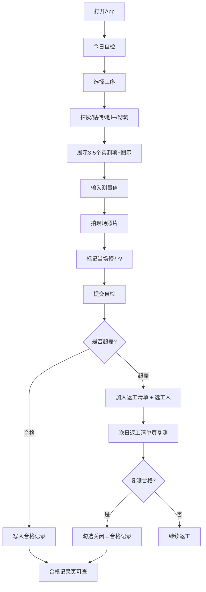

## 1. 产品概述

极简劳务班组长质量自检 App，将复杂质量验收表格简化为可执行的整改清单。服务于文化水平不一的现场劳务班组，每日收工前快速完成工序自检、超差登记、返工追踪。

- 解决问题：传统质检表格复杂难填、整改追踪混乱、班组上手门槛高
- 目标用户：劳务班组长（抹灰、贴砖、地坪、砌筑等工种负责人）
- 市场价值：降低质量管控成本、减少返工遗漏、提升现场执行力

## 2. 核心功能

### 2.1 用户角色
| 角色 | 注册方式 | 核心权限 |
|------|----------|----------|
| 班组长 | 本地使用（无需注册） | 完成自检、录入数据、拍照、安排返工、复测关闭 |

### 2.2 功能模块
1. **今日自检页**：工序选择、实测项展示（含图示）、测量值录入、现场拍照、当场修补标记
2. **返工清单页**：超差点列表、责任工人标注、复测操作、合格关闭
3. **合格记录页**：历史自检记录、合格项汇总、日期筛选查看

### 2.3 页面详情
| 页面名称 | 模块名称 | 功能描述 |
|----------|----------|----------|
| 今日自检 | 工序选择卡 | 大按钮选择：抹灰 / 贴砖 / 地坪 / 砌筑 |
| 今日自检 | 实测项卡片 | 每个工序展示3-5个实测项，含工具放置示意图、允许偏差值、测量值输入框 |
| 今日自检 | 拍照模块 | 调用摄像头/相册上传现场照片，一图一测项 |
| 今日自检 | 修补标记 | 单选按钮：已当场修补 / 未修补 |
| 今日自检 | 提交按钮 | 大尺寸提交按钮，自动判定超差并加入返工清单 |
| 返工清单 | 返工卡列表 | 展示超差点：工序、测项、偏差值、责任工人、状态（待处理/待复测/已合格） |
| 返工清单 | 责任工人选择 | 工人名单选择（可新增），标记谁来整改 |
| 返工清单 | 复测操作 | 输入复测值、拍照、勾选关闭 |
| 合格记录 | 时间筛选 | 按日期查看历史记录 |
| 合格记录 | 合格卡片 | 工序、测项、测量值、照片缩略图、班组长署名 |

## 3. 核心流程

班组长每日收工前打开 App，选择今日负责工序，依次完成 3-5 个实测项的测量录入、拍照、标记修补状态。系统自动比对标准值，超差点自动进入"明日返工"清单并绑定责任工人。次日班组长按清单逐项复测，输入复测值后勾选关闭。所有数据本地持久化存储，可在合格记录中追溯。

## 4. 用户界面设计

### 4.1 设计风格
- **主色**：工地安全橙（#FF6B1A）+ 深灰（#2C3E50），配合石灰白（#F8F5F0）背景
- **辅色**：合格绿（#27AE60）、警示红（#E74C3C）、待办黄（#F39C12）
- **按钮风格**：大尺寸圆角矩形（圆角 12px），高度 56px，最小点击区域 44×44px，全大写中文标签
- **字体**：中文优先使用「思源黑体 / 阿里巴巴普惠体」，字号偏大，正文字号 18px，按钮字号 20px，标题 24-28px
- **布局风格**：卡片式单列布局，大间距（16-24px），底部三栏 Tab 导航
- **图标风格**：写实施工图标（尺子、靠尺、塞尺、砖墙、抹子等），不使用抽象线图标，配合 emoji 增强识别

### 4.2 页面设计概览
| 页面名称 | 模块名称 | UI 元素 |
|----------|----------|---------|
| 今日自检 | 工序选择 | 4 个大尺寸彩色卡片（图标+文字），2×2 网格 |
| 今日自检 | 实测项列表 | 白色卡片，顶部工序标题栏，逐项展开：测项名 + 工具位置SVG示意图 + 标准范围 + 大数字输入框 + 拍照按钮 + 修补开关 |
| 今日自检 | 底部提交 | 吸底固定橙底白字提交按钮，高度 64px |
| 返工清单 | 状态筛选 | 顶部三段式 Tab：全部 / 待处理 / 待复测 / 已完成 |
| 返工清单 | 返工卡片 | 左侧色条标记状态（红/黄/绿），工序名 + 测项 + 偏差值 + 工人头像 + 复测按钮 |
| 合格记录 | 日历选择 | 顶部日期选择器，默认今日 |
| 合格记录 | 记录卡片 | 灰绿背景，工序 + 测项 + 数值 + 小图预览 + ✓ 标记 |

### 4.3 响应式设计
- 移动端优先（现场手机使用），同时适配平板
- 最小宽度 320px，断点 768px 以上改为双列卡片
- 所有交互按钮尺寸 ≥ 48×48px，间距 ≥ 12px，适合戴手套操作
- 禁止使用 hover 作为唯一交互方式，全部采用 click/tap

### 4.4 图示设计说明
每个实测项配套 SVG 示意图，直观展示测量工具放置位置：
- 抹灰垂直度：靠尺贴墙竖向放置示意 + 塞尺塞入缝隙
- 抹灰平整度：2米靠尺水平/斜向放置示意
- 贴砖空鼓：小锤敲击位置点阵示意
- 地坪标高：水平仪+标尺多点测量示意
- 砌筑灰缝：塞尺测量灰缝厚度示意
